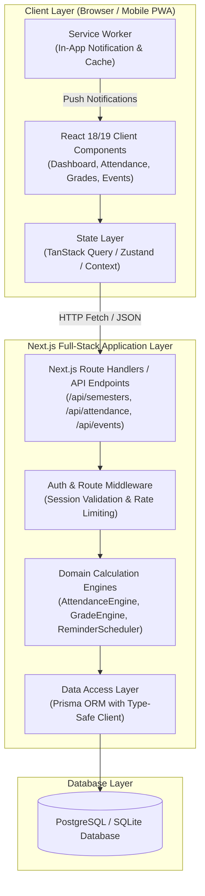
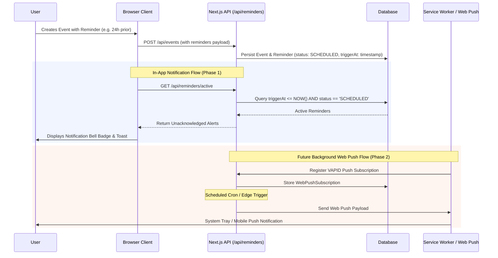

# System Architecture & Technical Specifications
## Smart Student Manager

---

## 1. Technology Stack Comparison & Recommendation

To ensure the system is **maintainable, simple, robust, student-developer friendly, and seamless to implement in an AI-assisted environment**, we evaluated three modern architectural options:

### 1.1 Stack Options Evaluated

| Criteria | Option 1: Next.js (App Router) + TypeScript + Prisma/Drizzle + SQLite / PostgreSQL | Option 2: Vite + React SPA + Express.js / Node REST API + PostgreSQL | Option 3: Vite + React SPA + Supabase (BaaS) / Firebase |
|---|---|---|---|
| **Architecture** | Full-Stack Unified (Frontend + Server Actions / Route Handlers) | Decoupled Client-Server (2 distinct repos or polyrepo) | Client-heavy with BaaS SDK |
| **Complexity for Devs** | **Low-Medium**: Single codebase, shared TypeScript types across API and UI | **Medium-High**: Managing two separate runtimes, CORS, JWT cookies across ports | **Low initial, High vendor lock-in**: Harder to run completely self-contained locally without cloud |
| **Local DX / AI Coding** | **Superior**: One dev server (`npm run dev`), atomic file edits, unified schema | **Good**: Need concurrent runners (`concurrently` or 2 terminals), more boilerplate | **Mixed**: Mocking Supabase locally requires Docker or internet connection |
| **Database & Auth** | Built-in Auth (NextAuth / Auth.js / Lucia) + Prisma ORM (SQLite for local dev, PostgreSQL for production) | Custom Express JWT / Passport + Prisma | Supabase Auth + RLS policies |
| **Notification Readiness** | Built-in API endpoints for Service Worker Web Push, cron triggers via Route Handlers | Background Node daemon (`node-cron`) | Supabase Database Webhooks / Edge Functions |
| **Deployment** | 1-click on Vercel, Railway, Render, or Node Docker container | 2 separate deployments (Vercel + Render/Railway) | Static hosting (Vercel) + Supabase Cloud |

### 1.2 Recommended Stack

> [!IMPORTANT]
> **Recommended Stack: Next.js 14/15 (App Router) + TypeScript + Tailwind CSS / Vanilla CSS Variables + Prisma ORM + SQLite (dev) / PostgreSQL (prod).**

#### Why this is the optimal choice:
1. **Single Unified Codebase:** No CORS misconfigurations, no separate frontend/backend deployments, and 100% end-to-end type safety from database models down to UI props.
2. **Student & AI Friendly:** Next.js App Router route handlers (`/api/...`) and Server Actions provide an intuitive RPC/REST paradigm that any computer science student can inspect, test, and extend.
3. **Database Flexibility:** Prisma ORM allows zero-friction local development on a self-contained SQLite file (no Docker or cloud credentials required to start coding) with a 1-line configuration switch to PostgreSQL (Supabase/Neon/Railway) for production.
4. **Reliable State & Forms:** React Server Components + React Hook Form + Zod for bulletproof schema validation.
5. **Future Notification Viability:** Next.js Route Handlers readily handle Web Push VAPID subscriptions and scheduled sync without external daemon services.

---

## 2. System Architecture Diagram



---

## 3. Calculation Logic & Mathematical Engines

Business logic must be **strictly decoupled from UI components** and located in pure, unit-tested TypeScript helper modules (`/lib/calculations/`).

### 3.1 Attendance Calculation Engine (`/lib/calculations/attendance.ts`)

Let:
- $C = \text{Total Classes Conducted}$ ($C \ge 0$)
- $A = \text{Classes Attended}$ ($0 \le A \le C$)
- $T = \text{Target Attendance Percentage}$ ($0 < T < 100$, typically $T = 75$)

#### Formulas:

1. **Current Attendance Percentage ($P$):**
   $$P = \begin{cases} 
   100.0\% & \text{if } C = 0 \quad (\text{Safe edge case, no classes held}) \\
   \left(\frac{A}{C}\right) \times 100 & \text{if } C > 0 
   \end{cases}$$

2. **Status Classification:**
   $$\text{Status} = \begin{cases}
   \text{NEUTRAL} & \text{if } C = 0 \\
   \text{ON\_TRACK} & \text{if } P \ge T \\
   \text{WARNING} & \text{if } T - 5 \le P < T \\
   \text{CRITICAL} & \text{if } P < T - 5
   \end{cases}$$

3. **Classes Allowed to Miss ("Bunk Buffer", $M$):**
   *Applicable when $P \ge T$ and $C > 0$.*
   If a student misses $M$ future classes consecutively, total conducted becomes $C + M$ while attended remains $A$.
   We require:
   $$\frac{A}{C + M} \ge \frac{T}{100}$$
   $$A \ge \frac{T}{100} (C + M) \implies A - \frac{T}{100}C \ge \frac{T}{100}M$$
   $$M \le \frac{A - \frac{T}{100}C}{\frac{T}{100}} = \frac{100A - TC}{T}$$
   Because classes are discrete integers:
   $$M = \max\left(0, \left\lfloor \frac{100A - TC}{T} \right\rfloor\right)$$

4. **Classes Needed to Catch Up ("Recovery Classes", $R$):**
   *Applicable when $P < T$.*
   If a student attends the next $R$ classes consecutively, both attended and conducted increase by $R$:
   $$\frac{A + R}{C + R} \ge \frac{T}{100}$$
   $$A + R \ge \frac{T}{100}C + \frac{T}{100}R \implies R\left(1 - \frac{T}{100}\right) \ge \frac{T}{100}C - A$$
   $$R\left(\frac{100 - T}{100}\right) \ge \frac{TC - 100A}{100}$$
   $$R \ge \frac{TC - 100A}{100 - T}$$
   Because classes are discrete integers:
   $$R = \max\left(0, \left\lceil \frac{TC - 100A}{100 - T} \right\rceil\right)$$

#### Edge Cases Handled:
- $C = 0, A = 0$: Returns $P = 100\%$, $M = 0$, $R = 0$, Status = `NEUTRAL`.
- $A > C$: Invalid input error rejected at validation layer ($A$ can never exceed $C$).
- $T \ge 100$: Denominator in catch-up $(100 - T)$ approaches zero; capped at $T \le 99.9\%$.
- Floating point inaccuracies: Rounded deterministically to 2 decimal places using `Math.round((val + Number.EPSILON) * 100) / 100`.

---

### 3.2 SGPA / CGPA Calculation Engine (`/lib/calculations/gpa.ts`)

The grading engine supports arbitrary university grading scales via a flexible configuration schema.

#### Configurable Grading Scale Definition:
```typescript
export interface GradePointMap {
  gradeLetter: string;      // e.g. "O", "A+", "A", "B", "F"
  gradePoint: number;       // e.g. 10.0, 9.0, 8.0, 0.0
  minPercentage?: number;   // e.g. 90, 80, 70
  maxPercentage?: number;   // e.g. 100, 89, 79
  isPassing: boolean;       // false for "F" / "Fail"
}
```

#### Formulas:

1. **Semester Grade Point Average (SGPA):**
   Let $N$ be the number of credit-bearing subjects in the semester. For subject $i$, let $c_i$ be credits and $g_i$ be grade point:
   $$\text{Total Semester Credits} = \sum_{i=1}^{N} c_i$$
   $$\text{Total Quality Points} = \sum_{i=1}^{N} (c_i \times g_i)$$
   $$\text{SGPA} = \begin{cases} 
   0.00 & \text{if } \sum c_i = 0 \\
   \frac{\sum_{i=1}^{N} (c_i \times g_i)}{\sum_{i=1}^{N} c_i} & \text{if } \sum c_i > 0 
   \end{cases}$$

2. **Cumulative Grade Point Average (CGPA):**
   Let $S$ be the total number of completed semesters. For semester $j$, let $C_j$ be the total credits and $SGPA_j$ be the semester grade point average:
   $$\text{CGPA} = \frac{\sum_{j=1}^{S} (C_j \times SGPA_j)}{\sum_{j=1}^{S} C_j} = \frac{\sum_{\text{all valid subjects}} (c_k \times g_k)}{\sum_{\text{all valid subjects}} c_k}$$

#### Audit & Non-Credit Courses:
- Courses marked with `isAudit: true` or `credits: 0` are excluded from both numerator and denominator in SGPA/CGPA calculations, but remain visible in academic history and attendance records.

---

## 4. Reminder & Notification Subsystem Architecture

To balance practical implementation with future extensibility, the reminder system follows a **three-tier architecture**:



### Realistic Execution Strategy:
- **Phase 1 (Client + Session-Driven):** When a student is active on the app, a lightweight poller/hook (`useReminders`) checks for triggers due in the database, updating the navigation notification bell and rendering dismissible toast alerts.
- **Phase 2 (HTML5 Notification API):** If user grants permission, desktop browser notifications are triggered locally via `new Notification(title, options)` while the tab or PWA is open.
- **Phase 3 (Web Push Protocol):** Server-side web push via VAPID keys for out-of-browser notifications.

---

## 5. Authentication & Authorization Approach

### Recommended: NextAuth.js (Auth.js) / Session-Based Cookie Auth
- **Session Mechanism:** HTTP-Only, `SameSite=Lax`, Secure cookies storing a signed JWT session.
- **Providers:**
  - Credentials Provider (Email & Password with salted argon2/bcrypt hashing).
  - Optional OAuth Provider (Google Sign-In for 1-click university student onboarding).
- **Data Isolation:** All database queries are strictly scoped to the authenticated `session.user.id`.
- **Middleware Guard:** Next.js `middleware.ts` intercepts `/dashboard/*`, `/attendance/*`, `/grades/*`, `/events/*`, and `/settings/*`, automatically redirecting unauthenticated traffic to `/login`.

---

## 6. State Management Approach

1. **Server State (Academic Data, Events, Attendance):**
   - Managed via **TanStack Query (React Query)** or Next.js Server Components with optimistic UI updates.
   - Eliminates redundant API calls with intelligent caching and background revalidation.
2. **Client State (Active Modals, Quick-Action Dials, Filter Toggles):**
   - Lightweight **Zustand store** or React Context for global UI states (e.g., active semester selector, sidebar collapse state, theme toggle).
3. **Form State:**
   - **React Hook Form** paired with **Zod** resolvers for instant client-side validation before network transmission.

---

## 7. Validation & Error Handling Strategy

### 7.1 Unified Validation with Zod
All inputs across both API routes and client forms share the exact same Zod schemas (`/lib/validations/`):
- `attendanceSchema`: Validates $A \ge 0$, $C \ge 0$, and $A \le C$.
- `gradeSchema`: Validates credit hours $> 0$, grade points within scale bounds ($0 \le g \le 10$).
- `eventSchema`: Validates event dates, ensuring end/due date is after start date.

### 7.2 Standardized API Error Response Contract
```json
{
  "success": false,
  "error": {
    "code": "VALIDATION_ERROR",
    "message": "Classes attended cannot exceed classes conducted.",
    "details": [
      {
        "field": "classesAttended",
        "issue": "Must be less than or equal to classesConducted"
      }
    ]
  }
}
```

---

## 8. Security Considerations

1. **Authentication & Session Hijacking Protection:** HTTP-Only cookies prevent XSS theft; CSRF protection enabled on mutating routes.
2. **SQL Injection Defense:** All queries pass through Prisma's parameterized AST compiler.
3. **Data Multi-Tenancy Isolation:** Every DB query enforces `where: { userId: session.user.id }`. No student can read or mutate another student's academic records.
4. **Input Sanitization:** Rich text notes and event descriptions are sanitized against XSS vectors.
5. **Rate Limiting:** Next.js middleware rate limiter on `/api/auth/*` routes to prevent brute-force attacks.

---

## 9. Recommended Folder & Project Structure

```
smart-student-manager/
├── docs/                             # Architecture & project specifications
│   ├── PRD.md
│   ├── ARCHITECTURE.md
│   ├── DATABASE.md
│   ├── USER-FLOWS.md
│   ├── UI-UX.md
│   └── DEVELOPMENT-PLAN.md
├── prisma/                           # Database Schema & Migrations
│   ├── schema.prisma
│   └── seed.ts                       # Realistic sample data for first-time boot
├── public/                           # Static assets, icons, manifest.json
│   ├── icons/
│   └── favicon.ico
├── src/
│   ├── app/                          # Next.js App Router (Pages & API Handlers)
│   │   ├── (auth)/                   # Auth Route Group (login, register, forgot-password)
│   │   ├── (dashboard)/              # Protected Route Group
│   │   │   ├── dashboard/            # Executive Overview Page
│   │   │   ├── grades/               # Semesters, Subjects & CGPA Page
│   │   │   ├── attendance/           # Subject Attendance & Bunk Simulator Page
│   │   │   ├── events/               # Calendar & Deadlines Page
│   │   │   ├── profile/              # Student Profile Page
│   │   │   ├── settings/             # System Configuration & Grading Rules
│   │   │   └── layout.tsx            # Protected Layout (Navbar, Sidebar, Notification Center)
│   │   ├── api/                      # REST Endpoints
│   │   │   ├── auth/[...nextauth]/
│   │   │   ├── semesters/
│   │   │   ├── subjects/
│   │   │   ├── attendance/
│   │   │   ├── events/
│   │   │   ├── reminders/
│   │   │   └── profile/
│   │   ├── layout.tsx                # Root layout (Theme providers, Toast container)
│   │   └── page.tsx                  # Landing / Welcome Page
│   ├── components/                   # Reusable UI Components
│   │   ├── ui/                       # Design System Primitives (Button, Input, Modal, Badge, Card)
│   │   ├── layout/                   # Sidebar, Header, MobileNav, NotificationBell
│   │   ├── dashboard/                # MetricCard, AttendanceRadar, UpcomingEventsList, CGPAChart
│   │   ├── attendance/               # AttendanceCard, BunkGauge, QuickIncrementButtons
│   │   ├── grades/                   # SemesterAccordion, SubjectTable, GradeScalePicker
│   │   └── events/                   # EventCard, CalendarView, ReminderConfigModal
│   ├── lib/                          # Core Utilities & Business Logic
│   │   ├── db.ts                     # Prisma Client singleton
│   │   ├── auth.ts                   # Auth.js / NextAuth configuration
│   │   ├── calculations/             # PURE BUSINESS LOGIC (100% Unit Tested)
│   │   │   ├── attendance.ts         # % calculations, bunk/catch-up formulas
│   │   │   ├── gpa.ts                # SGPA, CGPA, quality points formulas
│   │   │   └── grading-scales.ts     # Configurable scales (10-pt, 4.0-pt)
│   │   ├── validations/              # Shared Zod Schemas
│   │   │   ├── attendance.schema.ts
│   │   │   ├── grade.schema.ts
│   │   │   └── event.schema.ts
│   │   └── utils.ts                  # Date formatting, classnames helper
│   ├── hooks/                        # Custom React Hooks
│   │   ├── useAttendance.ts
│   │   ├── useAcademicSummary.ts
│   │   └── useReminders.ts
│   └── types/                        # Shared TypeScript Definitions
│       └── index.ts
├── tests/                            # Test Suites
│   ├── unit/                         # Formula unit tests (Attendance, SGPA, CGPA)
│   └── integration/                  # API endpoint tests
├── .env.example
├── package.json
├── tailwind.config.ts
└── tsconfig.json
```
