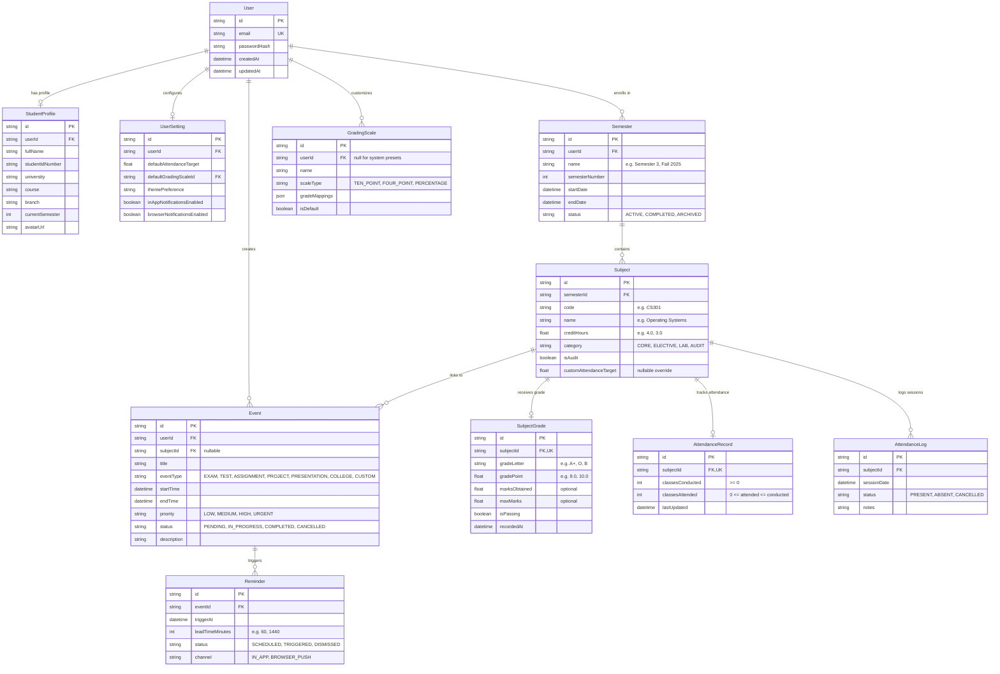

# Database & Entity Model Specification
## Smart Student Manager

---

## 1. Entity-Relationship Overview

The database design is strictly normalized to **3NF (Third Normal Form)** to eliminate data redundancy, prevent update anomalies, and enforce referential integrity across student records, academic history, attendance counters, and scheduled events.

### 1.1 Mermaid Entity-Relationship Diagram (ERD)



---

## 2. Entity Descriptions & Rationales

| Entity | Purpose & Design Rationale |
|---|---|
| **User** | Core identity entity managing authentication credentials, security timestamps, and data tenancy ownership. |
| **StudentProfile** | Decoupled 1-to-1 from `User` to separate auth credentials from personal academic metadata (institution, major, student ID). Enables student ID updates without touching user credentials. |
| **UserSetting** | Stores student preferences such as global attendance threshold ($75\%$), UI theme, and notification opt-ins. Keeps configuration separate from operational data. |
| **GradingScale** | Provides configurability. Accommodates 10-point, 4.0-point, or custom grading rubrics, avoiding hardcoded conversion formulas in code. Supports global system defaults plus student-customized scales. |
| **Semester** | Organizes subjects into academic periods. Holds temporal boundaries (`startDate`, `endDate`) and status (`ACTIVE`, `COMPLETED`) to support automatic CGPA rollups. |
| **Subject** | Core curriculum node. Maintains credits, course code, and elective classifications. Belongs to a semester, providing the foundation for both grading and attendance. |
| **SubjectGrade** | 1-to-1 extension of `Subject`. Holds final or provisional grades and grade points. Kept distinct from `Subject` so subjects can be planned before grades are issued. |
| **AttendanceRecord** | Fast aggregate counter ($C, A$) per subject for instant $O(1)$ dashboard reads, bunk calculations, and quick increments without querying individual class history. |
| **AttendanceLog** | Optional detailed timestamped history (Present / Absent / Cancelled per date). Allows students to audit their attendance record day by day while keeping the aggregate counters intact. |
| **Event** | Deadlines, exams, tests, presentations, and tasks. Optionally links to a `Subject` so the student can filter deadlines by course. |
| **Reminder** | Discrete alert triggers linked to an `Event`. Supports multiple reminder stages (e.g. 1 day before, 1 hour before) and tracks dismissal state. |

---

## 3. Data Integrity & Constraint Rules

1. **Attendance Feasibility Constraint:**
   - `classesConducted >= 0`
   - `classesAttended >= 0`
   - `classesAttended <= classesConducted`
   *(Enforced via DB check constraints and application Zod schemas).*
2. **Credits Integrity:**
   - `creditHours > 0` for credit-bearing courses; audit courses can be $0$.
3. **1-to-1 Relationships:**
   - Each `Subject` has at most one `AttendanceRecord` and at most one `SubjectGrade`.
4. **Cascading Deletions:**
   - Deleting a `User` cascades to delete their Profile, Settings, Semesters, and Events.
   - Deleting a `Semester` cascades to delete its `Subject` entries, which in turn cascades to delete corresponding grades, attendance counters, and logs.
   - Deleting an `Event` cascades to delete its `Reminder` rows.
5. **Multi-Tenancy Indexing:**
   - Composite indexes on `[userId, status]` and `[semesterId, code]` ensure low-latency queries during dashboard rendering.

---

## 4. Prisma ORM Schema Proposal (`prisma/schema.prisma`)

```prisma
datasource db {
  provider = "sqlite" // Easily swapped to "postgresql" for production
  url      = env("DATABASE_URL")
}

generator client {
  provider = "prisma-client-js"
}

enum Role {
  STUDENT
  ADMIN
}

enum SemesterStatus {
  ACTIVE
  COMPLETED
  ARCHIVED
}

enum SubjectCategory {
  CORE
  ELECTIVE
  LAB
  AUDIT
}

enum EventType {
  EXAM
  TEST
  ASSIGNMENT
  PROJECT
  PRESENTATION
  COLLEGE
  CUSTOM
}

enum Priority {
  LOW
  MEDIUM
  HIGH
  URGENT
}

enum EventStatus {
  PENDING
  IN_PROGRESS
  COMPLETED
  CANCELLED
}

enum ReminderStatus {
  SCHEDULED
  TRIGGERED
  DISMISSED
}

enum AttendanceStatus {
  PRESENT
  ABSENT
  CANCELLED
}

model User {
  id            String          @id @default(cuid())
  email         String          @unique
  passwordHash  String
  createdAt     DateTime        @default(now())
  updatedAt     DateTime        @updatedAt

  profile       StudentProfile?
  settings      UserSetting?
  semesters     Semester[]
  events        Event[]
  customScales  GradingScale[]

  @@index([email])
}

model StudentProfile {
  id              String   @id @default(cuid())
  userId          String   @unique
  user            User     @relation(fields: [userId], references: [id], onDelete: Cascade)
  fullName        String
  studentIdNumber String?
  university      String?
  course          String?
  branch          String?
  currentSemester Int      @default(1)
  avatarUrl       String?
  createdAt       DateTime @default(now())
  updatedAt       DateTime @updatedAt
}

model UserSetting {
  id                         String   @id @default(cuid())
  userId                     String   @unique
  user                       User     @relation(fields: [userId], references: [id], onDelete: Cascade)
  defaultAttendanceTarget    Float    @default(75.0)
  defaultGradingScaleId      String?
  themePreference            String   @default("system") // "light", "dark", "system"
  inAppNotificationsEnabled  Boolean  @default(true)
  browserNotificationsEnabled Boolean @default(false)
  createdAt                  DateTime @default(now())
  updatedAt                  DateTime @updatedAt
}

model GradingScale {
  id            String   @id @default(cuid())
  userId        String?  // null indicates standard system preset
  user          User?    @relation(fields: [userId], references: [id], onDelete: Cascade)
  name          String   // e.g. "Standard 10-Point Scale", "US 4.0 Scale"
  scaleType     String   // "TEN_POINT", "FOUR_POINT", "PERCENTAGE"
  gradeMappings String   // JSON string of GradePointMap[]
  isDefault     Boolean  @default(false)
  createdAt     DateTime @default(now())

  @@index([userId])
}

model Semester {
  id             String         @id @default(cuid())
  userId         String
  user           User           @relation(fields: [userId], references: [id], onDelete: Cascade)
  name           String         // e.g. "Semester 3 (Fall 2025)"
  semesterNumber Int
  startDate      DateTime?
  endDate        DateTime?
  status         SemesterStatus @default(ACTIVE)
  createdAt      DateTime       @default(now())
  updatedAt      DateTime       @updatedAt

  subjects       Subject[]

  @@unique([userId, semesterNumber])
  @@index([userId, status])
}

model Subject {
  id                     String           @id @default(cuid())
  semesterId             String
  semester               Semester         @relation(fields: [semesterId], references: [id], onDelete: Cascade)
  code                   String?          // e.g. "CS201"
  name                   String           // e.g. "Data Structures and Algorithms"
  creditHours            Float            @default(3.0)
  category               SubjectCategory  @default(CORE)
  isAudit                Boolean          @default(false)
  customAttendanceTarget Float?           // Override for subject (e.g. 80.0%)
  createdAt              DateTime         @default(now())
  updatedAt              DateTime         @updatedAt

  grade                  SubjectGrade?
  attendance             AttendanceRecord?
  attendanceLogs         AttendanceLog[]
  events                 Event[]

  @@index([semesterId])
}

model SubjectGrade {
  id            String   @id @default(cuid())
  subjectId     String   @unique
  subject       Subject  @relation(fields: [subjectId], references: [id], onDelete: Cascade)
  gradeLetter   String?  // e.g. "A+", "O", "B"
  gradePoint    Float?   // e.g. 9.0, 10.0
  marksObtained Float?   // e.g. 85.5
  maxMarks      Float?   @default(100.0)
  isPassing     Boolean  @default(true)
  recordedAt    DateTime @default(now())
  updatedAt     DateTime @updatedAt
}

model AttendanceRecord {
  id               String   @id @default(cuid())
  subjectId        String   @unique
  subject          Subject  @relation(fields: [subjectId], references: [id], onDelete: Cascade)
  classesConducted Int      @default(0)
  classesAttended  Int      @default(0)
  lastUpdated      DateTime @default(now()) @updatedAt
}

model AttendanceLog {
  id          String           @id @default(cuid())
  subjectId   String
  subject     Subject          @relation(fields: [subjectId], references: [id], onDelete: Cascade)
  sessionDate DateTime         @default(now())
  status      AttendanceStatus @default(PRESENT)
  notes       String?
  createdAt   DateTime         @default(now())

  @@index([subjectId, sessionDate])
}

model Event {
  id          String      @id @default(cuid())
  userId      String
  user        User        @relation(fields: [userId], references: [id], onDelete: Cascade)
  subjectId   String?
  subject     Subject?    @relation(fields: [subjectId], references: [id], onDelete: SetNull)
  title       String
  eventType   EventType   @default(ASSIGNMENT)
  startTime   DateTime
  endTime     DateTime?
  priority    Priority    @default(MEDIUM)
  status      EventStatus @default(PENDING)
  description String?
  createdAt   DateTime    @default(now())
  updatedAt   DateTime    @updatedAt

  reminders   Reminder[]

  @@index([userId, startTime])
  @@index([userId, status])
}

model Reminder {
  id              String         @id @default(cuid())
  eventId         String
  event           Event          @relation(fields: [eventId], references: [id], onDelete: Cascade)
  triggerAt       DateTime
  leadTimeMinutes Int            @default(60) // minutes before event
  status          ReminderStatus @default(SCHEDULED)
  channel         String         @default("IN_APP")
  createdAt       DateTime       @default(now())

  @@index([eventId])
  @@index([triggerAt, status])
}
```
