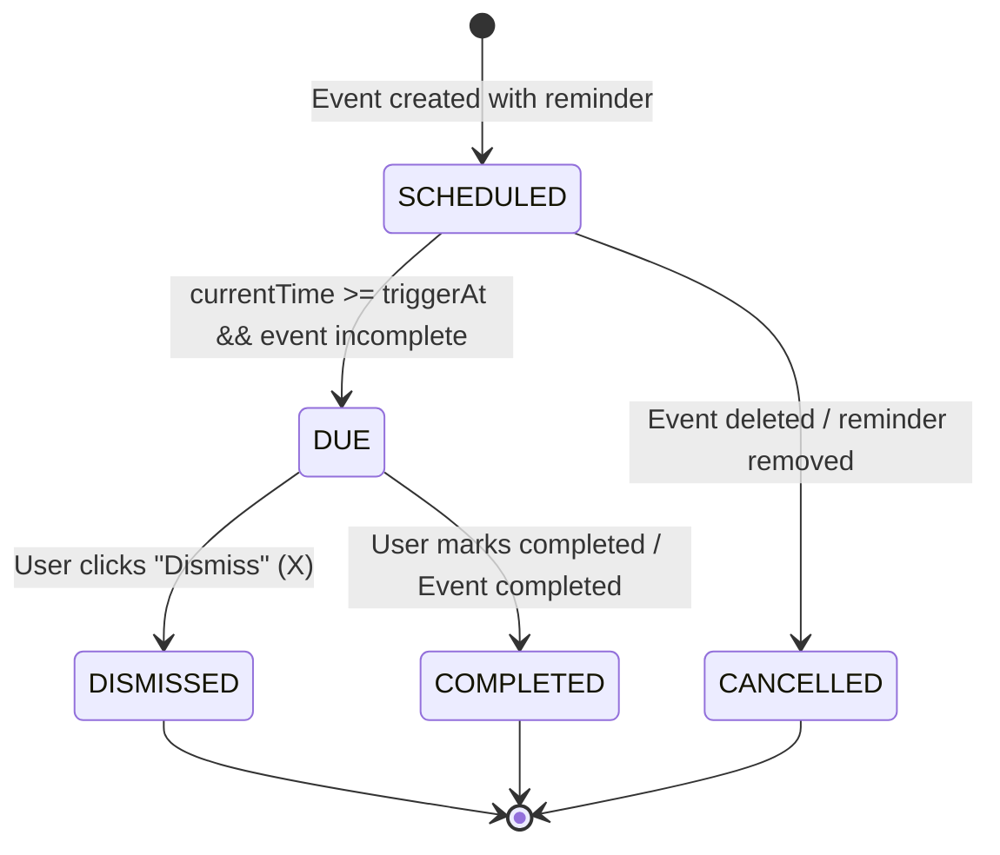

# Events & Reminders Architecture & Specification
## Smart Student Manager — Phase 5

---

## 1. Overview & Primary Product Goals

The **Event Manager & Reminder Subsystem** is an independent, high-performance module designed to allow students to organize all academic and personal deadlines, exam schedules, assignment submissions, college events, and custom tasks in one unified view.

### Key Capabilities
- **Fast Event Creation:** Sub-3-second event entry with smart defaults, quick-select reminder presets, and optional subject/semester linking.
- **Dual Presentation Views:** Interactive grouped **List View** (segmented by Overdue, Today, Tomorrow, This Week, Later, and Completed) and a monthly responsive **Calendar View**.
- **Multi-Tenant Security:** Strict tenant isolation at database and server action boundaries. Students cannot read, link, or mutate records belonging to other students.
- **Timezone Integrity:** Robust ISO-8601 storage and local-time presentation without midnight-boundary date drift or DST anomalies.
- **Reminder Pipeline:** Multi-tier reminder support with presets (`At time`, `10 min`, `30 min`, `1 hour`, `1 day`, `2 days`, `1 week`), custom offsets, due detection, in-app bell center, and browser-level notification integration.

---

## 2. Event & Reminder Data Models

### 2.1 Prisma Schema Entity Definitions

```prisma
enum EventType {
  EXAM
  TEST
  ASSIGNMENT
  PROJECT
  PRESENTATION
  COLLEGE_EVENT
  PERSONAL
  OTHER
  // Backward compatibility aliases
  COLLEGE
  CUSTOM
}

enum Priority {
  LOW
  MEDIUM
  HIGH
}

enum ReminderStatus {
  SCHEDULED
  DUE
  COMPLETED
  DISMISSED
  CANCELLED
  TRIGGERED // Legacy alias for DUE
}

model Event {
  id          String      @id @default(cuid())
  userId      String
  user        User        @relation(fields: [userId], references: [id], onDelete: Cascade)
  title       String
  description String?
  type        EventType
  priority    Priority    @default(MEDIUM)
  startTime   DateTime
  endTime     DateTime?
  isAllDay    Boolean     @default(false)
  status      EventStatus @default(PENDING) // PENDING | COMPLETED | CANCELLED

  semesterId  String?
  semester    Semester?   @relation(fields: [semesterId], references: [id], onDelete: SetNull)
  subjectId   String?
  subject     Subject?    @relation(fields: [subjectId], references: [id], onDelete: SetNull)

  reminders   Reminder[]

  createdAt   DateTime    @default(now())
  updatedAt   DateTime    @updatedAt

  @@index([userId, startTime])
  @@index([userId, status])
  @@index([subjectId])
  @@index([semesterId])
}

model Reminder {
  id              String         @id @default(cuid())
  eventId         String
  event           Event          @relation(fields: [eventId], references: [id], onDelete: Cascade)
  triggerAt       DateTime
  leadTimeMinutes Int            // 0 = At event time, 60 = 1 hour before, 1440 = 1 day before
  status          ReminderStatus @default(SCHEDULED)
  channel         String         @default("IN_APP") // IN_APP, BROWSER

  createdAt       DateTime       @default(now())
  updatedAt       DateTime       @updatedAt

  @@index([eventId])
  @@index([triggerAt, status])
}
```

### 2.2 Referential Integrity & Cascade Rules
- **Cascade Deletion:** When an `Event` is deleted, all associated `Reminder` records are automatically removed via `onDelete: Cascade`. No orphaned reminder rows can exist.
- **Graceful Nullification:** If a `Subject` or `Semester` is deleted, associated events retain their historical record and status with `subjectId` or `semesterId` set to `null` via `onDelete: SetNull`.

---

## 3. Event Types & Human-Readable Mapping

| Prisma Enum Value | UI Display Label | Visual Badge Accent | Semantic Context |
| :--- | :--- | :--- | :--- |
| `EXAM` | **Exam** | Red / Crimson | Major end-sem, mid-sem, or final exams |
| `TEST` | **Test / Quiz** | Amber / Orange | Class tests, pop quizzes, unit evaluations |
| `ASSIGNMENT` | **Assignment** | Indigo / Violet | Homework, problem sets, lab reports |
| `PROJECT` | **Project** | Cyan / Sky | Milestone submissions, term projects, caps |
| `PRESENTATION` | **Presentation** | Purple / Violet | Seminars, slide decks, oral defenses |
| `COLLEGE_EVENT` | **College Event** | Emerald / Green | Fests, guest lectures, hackathons, workshops |
| `PERSONAL` | **Personal** | Blue / Teal | Study sessions, doctor visits, personal tasks |
| `OTHER` | **Other** | Neutral Gray | Miscellaneous items |

---

## 4. Priority System

To ensure accessibility and high visual clarity without relying exclusively on color, priorities are rendered with explicit textual labels, iconography, and distinct borders:

| Priority | Visual Flag Icon | Badge Styling | Meaning |
| :--- | :--- | :--- | :--- |
| `HIGH` | 🚩 Red Flag | Red badge + bold text | Critical deadline or mandatory exam |
| `MEDIUM` | ⚑ Amber Flag | Amber badge + medium text | Standard academic or personal deadline |
| `LOW` | ⚐ Emerald Flag | Slate/Neutral badge | Optional, low-urgency, or flexible task |

---

## 5. Reminder Presets & Lifecycle

### 5.1 Lead Time Presets

| Preset Label | `leadTimeMinutes` | Trigger Computation |
| :--- | :--- | :--- |
| **At event time** | `0` | `event.startTime - 0 min` |
| **10 minutes before** | `10` | `event.startTime - 10 min` |
| **30 minutes before** | `30` | `event.startTime - 30 min` |
| **1 hour before** | `60` | `event.startTime - 60 min` |
| **1 day before** | `1,440` | `event.startTime - 24 hours` |
| **2 days before** | `2,880` | `event.startTime - 48 hours` |
| **1 week before** | `10,080` | `event.startTime - 7 days` |
| **Custom** | `N` | `event.startTime - N min` |

### 5.2 Reminder State Machine & Transitions



- **SCHEDULED:** Reminder trigger timestamp is in the future.
- **DUE:** System clock has passed `triggerAt`, the event is still `PENDING`, and the student has not dismissed the alert.
- **COMPLETED:** Student explicitly acknowledged and completed the task, or the parent event was marked completed.
- **DISMISSED:** Student dismissed the alert from the notification bell popover or `/reminders` action center.
- **CANCELLED:** Event was deleted or reminder was explicitly removed during editing.

---

## 6. Timezone Handling & Date-Only Events

Timezone mishandling is one of the most common sources of calendar bugs (events shifting to the previous or next day). The following strict patterns are enforced:

1. **Storage Consistency:** All timestamps in SQLite / PostgreSQL are stored as standard UTC ISO-8601 strings (`DateTime`).
2. **Local Component Construction:** Date and time inputs from the client are combined into UTC instances using numeric getters (`getFullYear()`, `getMonth()`, `getDate()`, `getHours()`, `getMinutes()`) rather than naive string concatenation:
   ```ts
   export function combineDateAndTime(dateStr: string, timeStr?: string | null): Date {
     const [year, month, day] = dateStr.split("-").map(Number);
     if (!timeStr) {
       return new Date(year, month - 1, day, 0, 0, 0, 0);
     }
     const [hours, minutes] = timeStr.split(":").map(Number);
     return new Date(year, month - 1, day, hours, minutes, 0, 0);
   }
   ```
3. **Date-Only Flag (`isAllDay`):**
   - When an event is created without a specific time, `isAllDay` is set to `true` and the event is pinned to local midnight.
   - When rendering date-only events in the calendar or card views, date extraction uses local numeric parts (`d.getFullYear()`, `d.getMonth() + 1`, `d.getDate()`), preventing negative UTC offset shifts from moving Monday back to Sunday.
4. **Human-Friendly Display:** Dates are formatted using `Intl.DateTimeFormat` or custom helpers (`formatHumanDate`, `formatHumanTime`, `formatHumanRelativeDate`) respecting the user's browser locale.

---

## 7. In-App Reminders & Real-World Browser Notifications

### 7.1 In-App Notification Bell & Polling
- **Header Bell Component (`NotificationBell`):** Lives in the `TopNavbar`. On mount and every 60 seconds, it queries `getReminders("DUE")`.
- **Visual Badge:** Displays a count of due alerts (e.g. `2 Due`).
- **Interactive Dropdown Popover:** Shows top due events with 1-click **Dismiss** and direct links to `/events` and `/reminders`.

### 7.2 Browser Notification Capabilities (Honest Disclosure)

> [!IMPORTANT]
> **What Works Today (Client-Side HTML5 Notification API):**
> - When the student has the application open in a browser tab and grants permission, browser notifications trigger locally on the desktop/mobile operating system via `dispatchBrowserNotification()`.
> - If multiple due reminders occur while the tab is active, desktop notifications pop up in the OS notification tray.
>
> **What Does NOT Work Today (No False Background Claims):**
> - If the user's browser is completely closed or device is off, notifications **cannot** trigger without a standalone backend push service (Web Push API + VAPID keys + service worker registration + push service worker message relay).
> - We do **not** claim to provide background offline notifications in Phase 5.

### 7.3 Future Push Notification Architecture (VAPID / Service Worker)
To enable true closed-browser notifications in a future enhancement:
1. Generate VAPID key pairs (`NEXT_PUBLIC_VAPID_PUBLIC_KEY` & `VAPID_PRIVATE_KEY`).
2. Register a Service Worker in `/public/sw.js` with `push` and `notificationclick` listeners.
3. Add a `PushSubscription` model in Prisma linked to `User`.
4. Create a background cron runner (e.g., node-cron or BullMQ worker) to poll `triggerAt <= now() && status == 'SCHEDULED'` and dispatch payloads using `web-push`.

---

## 8. Multi-Tenant Authorization & Security

1. **Session Requirement:** Every server action enforces `await requireAuth(ctx)` which retrieves the verified session user ID from the encrypted JWT session cookie. Client-provided `userId` parameters are completely rejected.
2. **Strict Record Ownership (`assertUserOwnsRecord`):**
   - Before fetching, updating, or deleting an `Event`, its `userId` is compared with `user.id`. Unauthorized access immediately throws an `AuthError (403 Forbidden)`.
   - Before deleting or dismissing a `Reminder`, the server verifies that the reminder belongs to an event owned by the authenticated student.
3. **Foreign Key Integrity Across Tenants:**
   - When a student links an event to a `subjectId`, `assertUserOwnsRecord(subject.userId, user.id)` ensures the subject belongs to the caller.
   - When a student links an event to a `semesterId`, `assertUserOwnsRecord(semester.userId, user.id)` ensures the semester belongs to the caller.
   - Cross-student record linking is strictly impossible.
4. **Atomic Transactions:** Event creation with multiple reminders executes inside `prisma.$transaction(...)`. If any validation fails, no partial or orphaned rows are created.

---

## 9. User Experience & Responsive Design

- **Quick Add Modal:** Allows fast entry with title, date, priority, and 1-click reminder presets.
- **Cascading Selectors:** Selecting a Semester automatically filters the Subject dropdown to subjects belonging to that semester.
- **Search & Filters:** Real-time client search across title and description, combined with server-ready multi-facet filters (Type, Priority, Status, Sort).
- **Responsive Layout:**
  - **Desktop (1024px+):** Full 7-column calendar grid with direct event title pills, sidebar navigation, top header notification center.
  - **Mobile (375px+):** Calendar switches to compact day cells with indicator dots; tapping any date opens an event inspector modal. All cards stack neatly with full touch targets.
