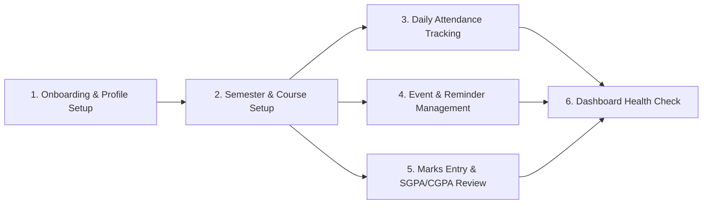
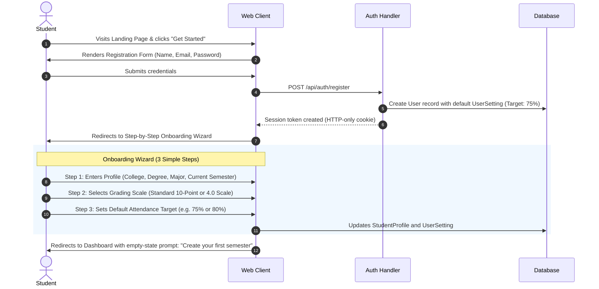
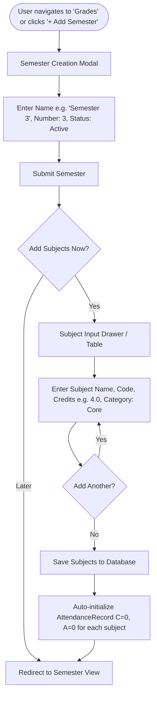
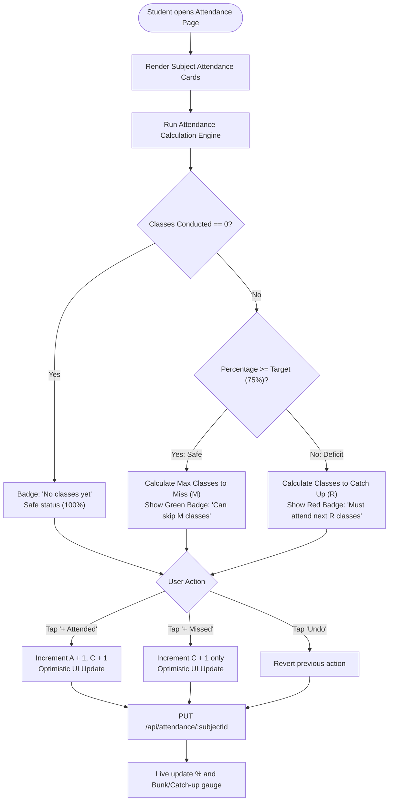
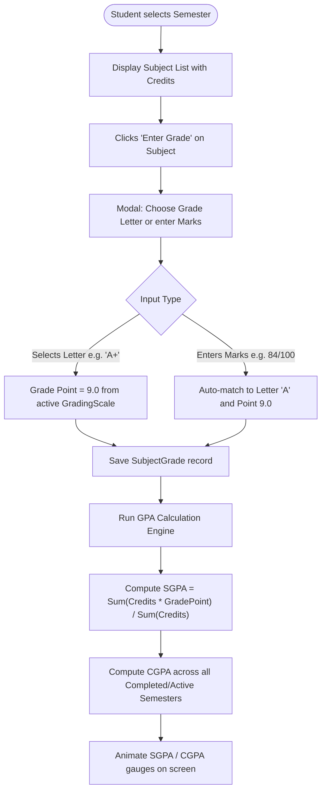
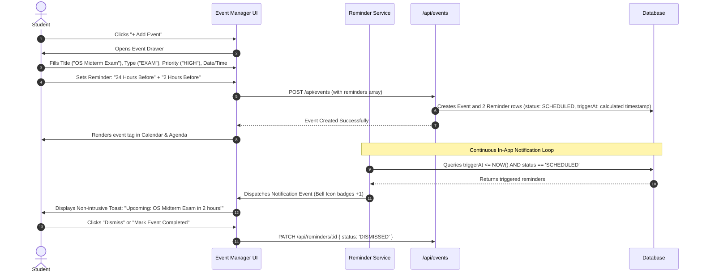

# User Flows & Interaction Workflows
## Smart Student Manager

---

## 1. Primary User Journeys

---

## 2. Detailed Step-by-Step User Flows

### 2.1 Flow 1: Onboarding & First-Time Setup

#### Edge Cases & Recovery:
- **Email already registered:** Real-time form error displayed inline before page refresh.
- **Skipped Wizard:** Default settings (10-Point scale, 75% attendance target) are populated automatically so the student can start immediately without being blocked.

---

### 2.2 Flow 2: Semester & Subject Enrollment Flow

#### Key Architecture Rule:
Whenever a subject is created, an associated `AttendanceRecord` is automatically instantiated with `classesConducted = 0` and `classesAttended = 0`. This guarantees zero orphan subject states and instant attendance availability.

---

### 2.3 Flow 3: Daily Attendance Logging & "Bunk Simulator" Flow

#### Edge Cases & Protection:
- **Accidental double click:** Rapid debouncing on action buttons prevents accidental bursts.
- **Attended > Conducted Attempt:** If user manually edits numbers in modal and sets $A > C$, client-side Zod validation stops submission and outlines the field in red.

---

### 2.4 Flow 4: Marks Entry & SGPA/CGPA Audit Flow

---

### 2.5 Flow 5: Event Creation & Reminder Trigger Lifecycle

---

## 3. Summary of Exception Handling in User Flows

| Flow | Scenario | System Handling |
|---|---|---|
| **Attendance** | Student enters 0 conducted classes | System gracefully shows $100\%$ placeholder with prompt "No classes conducted yet", avoiding `0/0` NaN errors. |
| **Attendance** | Target is set to $100\%$ | Catch-up formula avoids division by zero $(100 - 100)$ by enforcing a maximum allowed target of $99.9\%$ in validation rules. |
| **Grades** | Semester has only 0-credit audit courses | SGPA is reported as `N/A` rather than `0.00`, preventing false academic failure flags. |
| **Events** | Event start date is set in the past | Allowed for retrospective record-keeping, but reminder generation is automatically skipped. |
| **Network** | Device goes offline during attendance click | Optimistic UI update informs student: "Saved locally. Syncing with cloud..." and retries on reconnect. |
